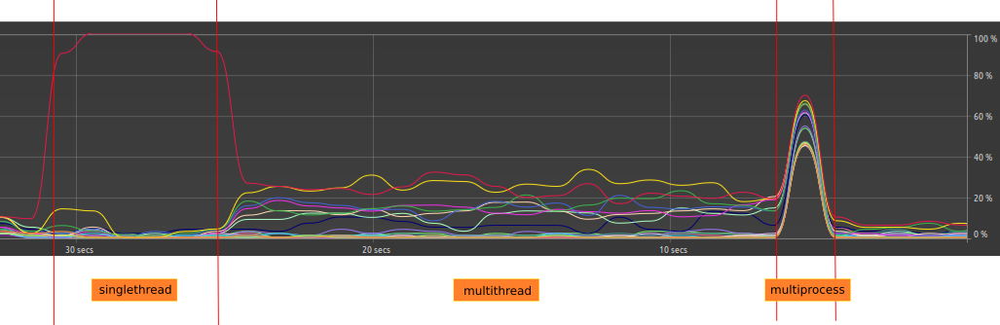

## Demandando da rede:
Aqui paralelizamos requisições à sites. O resultado é que o multithread é mais rápido que o singlethread,
e o multiprocess é só um pouco mais rápido que o multithread. 
(provável característica do requests.get)

```text
/home/marcos/.virtualenvs/exploring_paralelism/bin/python /home/marcos/work/storm/labs/exploring_paralelism/main.py 
Starting singlethread
Singlethread texts: #89 in National Universities (tie), (tie), (tie), 12,000, 2.1.1, 2.1.2, 2.1.3, 346 VISUALIZAÇÕES...
singlethread took 6.912031650543213 seconds

Starting multithread
Using 20 workers
Multithread texts: 12,000, 1867 - present, 2.1.1, 2.1.2, 2.1.3, 346 VISUALIZAÇÕES, 43 línguas, 53 nations., 53 states...
multithread took 2.4511075019836426 seconds

Starting multiproc
Using 20 processes
Multiprocess texts: #89 in National Universities (tie), (tie), (tie), 12,000, 2.1.1, 2.1.2, 2.1.3, 346 VISUALIZAÇÕES,...
multiproc took 2.3061654567718506 seconds

Process finished with exit code 0
```

## Demandando do processador:

Agora vamos comparar com uma demanda grande do processador (não de rede):

Executamos um fibo simples, com 30 elementos, 50 vezes, e vemos que o multithread mais demorado do que
o singlethread. Já o multiprocess... veja o resultado.

```text
/home/marcos/.virtualenvs/exploring_paralelism/bin/python /home/marcos/work/storm/labs/exploring_paralelism/using_processor.py 
Starting singlethread
Singlethread result: 41602000
singlethread took 5.883777618408203 seconds

Starting multithread
Using 20 workers
Multithread result: 41602000
multithread took 11.317415237426758 seconds

Starting multiproc
Using 20 processes
Multiprocess result: 41602000
multiproc took 0.6552731990814209 seconds

Process finished with exit code 0
```
Note que enquanto o multithread executava, os processadores não 
foram muito demandados, como no singlethread. Já o multiprocess
demandou todos os processadores, como podemos ver na imagem abaixo.

